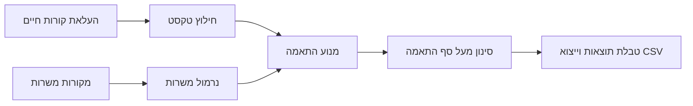

# ארכיטקטורה

המערכת בנויה בשלוש שכבות:

1. `Connectors`
   איסוף משרות ממקורות שונים: קובץ JSON, API שמחזיר JSON, ובהמשך מקורות מאושרים כמו Feed של אתר דרושים או API של ספק חיצוני.

2. `Resume extraction`
   חילוץ טקסט מקורות חיים בפורמטים `PDF`, `DOCX`, `TXT`.
   הקובץ המרכזי: `scripts/extract_resume.py`.

3. `Matching engine`
   חישוב התאמה בין קורות החיים למשרה, כולל תפקיד, כישורים, תחומים, מיקום, מודל עבודה, מילות סינון, וחפיפה טקסטואלית.
   הקובץ המרכזי: `src/matcher.mjs`.

השרת המקומי נמצא ב-`server.mjs`.
הממשק נמצא בתיקיית `public`.

## זרימת עבודה

## חיבור מקור משרות חדש

מוסיפים מקור ל-`config/sources.json`.
אם המקור מחזיר JSON, בדרך כלל מספיק להשתמש ב-`type: "jsonApi"` ולהגדיר `fieldMap`.

אם המקור דורש לוגיקה מיוחדת, מוסיפים קובץ חדש תחת `src/connectors`.
