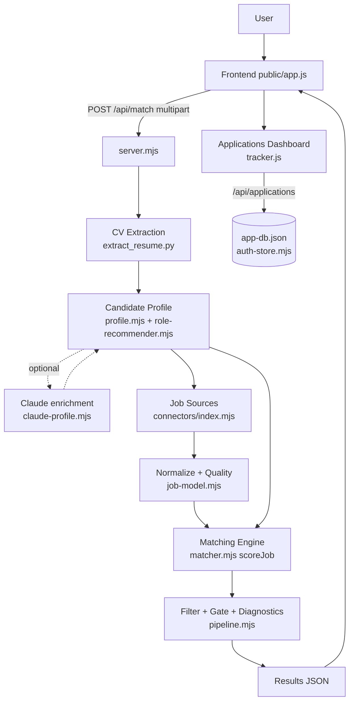
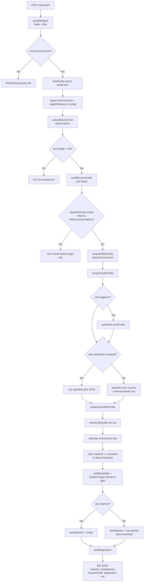
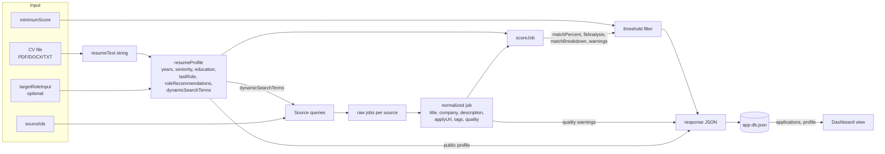
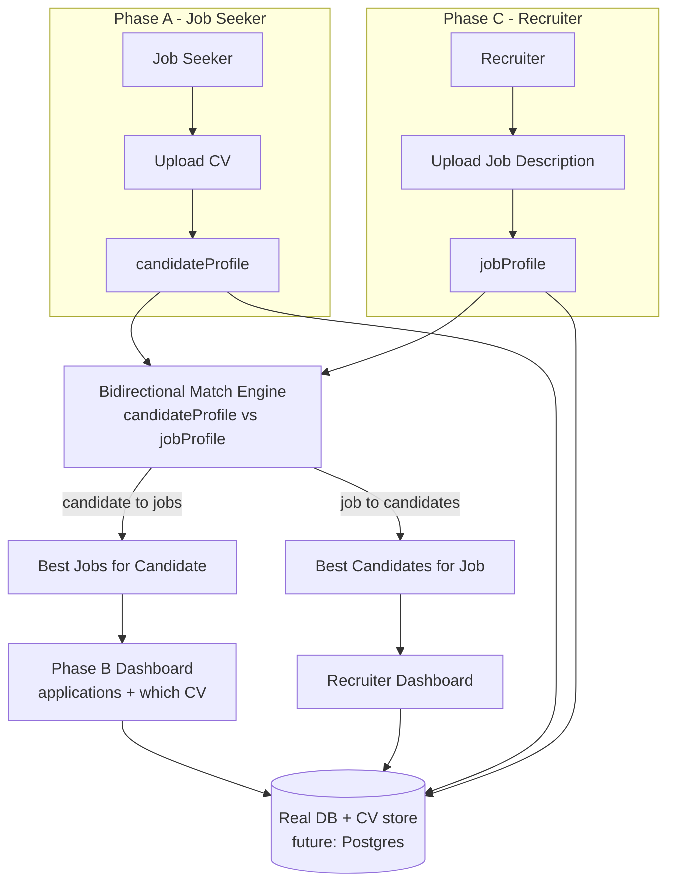
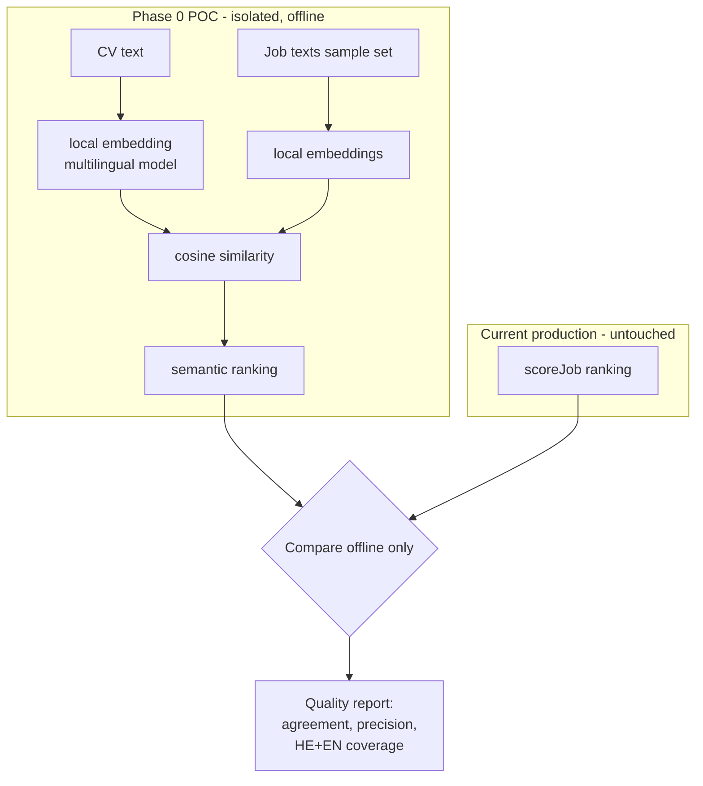

# Job Agent — ארכיטקטורה

מסמך זה ממפה את הארכיטקטורה הקיימת של `Job Agent`, את החזון לשלבים הבאים, ואת
ארכיטקטורת היעד. תרשימי ה-`Mermaid` כתובים בתוויות **אנגלית** לתאימות `Draw.io`
ולמניעת שיבושי `RTL`; ההסברים בעברית. תרשימים נקיים בלבד נמצאים גם בקובץ הנפרד
[`architecture.mmd`](architecture.mmd).

> מסמך תיעוד בלבד. אינו משנה קוד, scoring, מקורות משרות או לוגיקת `Claude`.

---

## 1. חזון המוצר

`Job Agent` נועד להפוך למוצר private-beta אמין שעוזר לכל אדם למצוא משרות פתוחות
ורלוונטיות מתוך קורות-החיים שלו. ההתנהגות הרצויה כמו יועץ קריירה והתאמת-משרות מעשי:

1. המשתמש מעלה קורות-חיים.
2. האפליקציה מחלצת טקסט מקורות-החיים.
3. נבנה פרופיל מועמד מובנה.
4. המשתמש יכול להוסיף תפקיד-יעד (אופציונלי).
5. המערכת סורקת את מקורות המשרות המוגדרים.
6. כל משרה מוערכת מול פרופיל המועמד.
7. מוחזרים אחוז התאמה, רמת ביטחון, חוזקות, פערים, סיכונים והמלצה.
8. המשתמש שומר משרות רלוונטיות לדשבורד הגשות.

עקרונות: המוצר **candidate-agnostic** (כל קורות-חיים = אדם חדש), תפקיד-היעד מכוון
חיפוש אך אינו מחליף ניתוח CV, ותוצאות כנות ומוסברות עדיפות על ציונים אופטימיים.

---

## 2. תקציר ארכיטקטורה קיימת

שרת `Node.js` יחיד (מודול `http` מובנה, ללא framework) שמשרת גם את ה-API וגם את
הקבצים הסטטיים. הארכיטקטורה שכבתית ומודולרית:

- **שכבת HTTP** (`server.mjs`) — ניתוב, אימות, ניהול `multipart`.
- **חילוץ CV** — תהליך `Python` חיצוני (`scripts/extract_resume.py`) דרך `spawn`,
  תומך ב-`PDF`/`DOCX`/`TXT`/`MD`/`CSV`.
- **פרופיל מועמד** — `profile.mjs` (חוקים) + `claude-profile.mjs` (העשרה
  אופציונלית דרך `Claude API`) + `role-recommender.mjs` (זיהוי תפקידים).
- **שליפת משרות** — `connectors/` עם 7 מקורות + נרמול ובקרת איכות (`job-model.mjs`).
- **מנוע התאמה** — `matcher.mjs` (`scoreJob`, מודל 6 רכיבים משוקלל + חוקי תקרה)
  עם `job-fit.mjs` כשכבת evaluator מובנית מעליו.
- **אחסון** — `auth-store.mjs`, מסד נתונים מבוסס קובץ `JSON` יחיד
  (`data/app-db.json`) למשתמשים, sessions והגשות.
- **Frontend** — `public/` (HTML/JS/CSS vanilla, ללא build step).

עיקרון מפתח: **scoring ובקרת איכות מופרדים** — `job-model.mjs` נותן
`dataQualityScore` (איכות נתוני המשרה), ו-`matcher.mjs` נותן `matchPercent`
(התאמה). שני צירים נפרדים.

---

## 3. טבלת מודולים

| קובץ / תיקייה | אחריות |
|---|---|
| `server.mjs` | שרת HTTP, ניתוב, `/api/match`, אימות, `multipart`, הפעלת חילוץ CV |
| `scripts/extract_resume.py` | חילוץ טקסט מ-`PDF`/`DOCX`/`TXT`/`MD`/`CSV` (תהליך נפרד) |
| `src/profile.mjs` | בניית פרופיל מועמד מבוסס-חוקים + מיזוג העשרת `Claude` |
| `src/claude-profile.mjs` | העשרת פרופיל אופציונלית דרך `Claude API` (tool-use, נפילה רכה ל-`null`) |
| `src/role-recommender.mjs` | זיהוי משפחות תפקידים, שנות ניסיון, השכלה, תפקיד אחרון, מונחי חיפוש |
| `src/pipeline.mjs` | תזמור: config/משרות, scoring, relevance gate, near-matches, diagnostics |
| `src/matcher.mjs` | מנוע ה-scoring (`scoreJob`/`rankJobs`) — מודל 6 רכיבים + חוקי תקרה |
| `src/job-fit.mjs` | evaluator מובנה מעל `scoreJob` (candidateProfile/jobProfile/10 ממדים) |
| `src/connectors/index.mjs` | טעינת מקורות, dedupe, איסוף notices ו-sourceLinks |
| `src/connectors/*.mjs` | מחברים פר-מקור (`remotive`, `himalayas`, `hiremetech`, `alljobs`, `drushim`, `file`, `json-api`) |
| `src/connectors/job-model.mjs` | נרמול משרות לסכמה אחידה + `assessJobQuality` |
| `src/connectors/search-pages.mjs` | בניית קישורי חיפוש ישירים (LinkedIn וכו') |
| `src/text.mjs` | `normalizeText`/`tokenize`/`includesPhrase` (עברית+אנגלית) |
| `src/io.mjs` | קריאה/כתיבה של `JSON`/`CSV`/טקסט |
| `src/server/auth-store.mjs` | משתמשים, sessions (cookie + `pbkdf2`), פרופיל, הגשות — מסד `JSON` |
| `src/server/multipart.mjs` | ניתוח `multipart/form-data` |
| `src/server/static.mjs` | הגשת קבצים סטטיים מ-`public/` |
| `config/search-profile.json` | מילון כישורים/מונחים/aliases ל-scoring |
| `config/sources.json` | הגדרות מקורות המשרות והפעלה/כיבוי |
| `public/index.html` + `app.js` | מסך ראשי: העלאה, סריקה, תצוגת תוצאות |
| `public/tracker.html` + `tracker.js` | דשבורד הגשות |
| `public/auth.js` | רישום/התחברות בצד לקוח |

---

## 4. זרימת בקשה ברמה גבוהה

המשתמש מעלה CV דרך ה-frontend, השרת מחלץ טקסט, בונה פרופיל, סורק מקורות, מדרג, מסנן
ומחזיר תוצאות; משרות שמורות נשמרות בדשבורד.

```mermaid
flowchart TD
    U[User] --> FE[Frontend public/app.js]
    FE -->|POST /api/match multipart| SRV[server.mjs]
    SRV --> EXT[CV Extraction<br/>extract_resume.py]
    EXT --> PROF[Candidate Profile<br/>profile.mjs + role-recommender.mjs]
    PROF -.optional.-> CLAUDE[Claude enrichment<br/>claude-profile.mjs]
    CLAUDE -.-> PROF
    PROF --> SRC[Job Sources<br/>connectors/index.mjs]
    SRC --> NORM[Normalize + Quality<br/>job-model.mjs]
    NORM --> ENG[Matching Engine<br/>matcher.mjs scoreJob]
    PROF --> ENG
    ENG --> PIPE[Filter + Gate + Diagnostics<br/>pipeline.mjs]
    PIPE --> RES[Results JSON]
    RES --> FE
    FE --> DASH[Applications Dashboard<br/>tracker.js]
    DASH -->|/api/applications| STORE[(app-db.json<br/>auth-store.mjs)]
```

---

## 5. זרימת `/api/match` מפורטת

מבוססת על `handleMatch` ב-`server.mjs` ו-`analyzeJobsWithProfile` ב-`pipeline.mjs`.

```mermaid
flowchart TD
    A[POST /api/match] --> B[parseMultipart<br/>fields + files]
    B --> C{resume file present?}
    C -->|No| C1[400 Missing resume file]
    C -->|Yes| D[loadConfig search-profile.json]
    D --> E[Apply minimumScore + targetRoleInput to config]
    E --> F[extractResumeText<br/>spawn python]
    F --> G{text length >= 80?}
    G -->|No| G1[422 Not enough text]
    G -->|Yes| H[buildResumeProfile<br/>rule-based]
    H --> I{targetRoleInput empty<br/>AND no roleRecommendations?}
    I -->|Yes| I1[422 Cannot detect target role]
    I -->|No| J[analyzeWithClaude<br/>optional enrichment]
    J --> K[mergeClaudeProfile]
    K --> L{user logged in?}
    L -->|Yes| L1[authStore.saveProfile]
    L --> M{jobs uploaded in payload?}
    L1 --> M
    M -->|Yes| N1[Use uploaded jobs JSON]
    M -->|No| N2[loadJobs from sources<br/>connectors/index.mjs]
    N1 --> O[analyzeJobsWithProfile]
    N2 --> O
    O --> P[assessJobQuality per job]
    P --> Q[rankJobs scoreJob per job]
    Q --> R[Split: matches >= threshold<br/>vs belowThreshold]
    R --> S[buildGateState +<br/>isJobOnTarget relevance gate]
    S --> T{any matches?}
    T -->|Yes| T1[nearMatches = empty]
    T -->|No| T2[nearMatches = top relevant<br/>below threshold]
    T1 --> V[buildDiagnostics]
    T2 --> V
    V --> W[200 JSON:<br/>matches, nearMatches,<br/>resumeProfile, diagnostics, csv]
```

**נקודות החלטה מרכזיות:**
- **שער כפול לפני scoring:** חייבים או `targetRoleInput` או `roleRecommendations`
  מזוהים, אחרת `422`.
- **`Claude` אופציונלי בלבד:** ללא `ANTHROPIC_API_KEY` או בכשל קריאה — מוחזר `null`
  והזרימה ממשיכה עם פרופיל מבוסס-חוקים.
- **relevance gate** פועל רק על משרות *מתחת* לסף, ולעולם לא נוגע במשרות שעברו.

---

## 6. זרימת נתונים

```mermaid
flowchart LR
    subgraph Input
      CV[CV file<br/>PDF/DOCX/TXT]
      TR[targetRoleInput<br/>optional]
      MS[minimumScore]
      SI[sourceIds]
    end

    CV --> RT[resumeText string]
    RT --> RP[resumeProfile<br/>years, seniority, education,<br/>lastRole, roleRecommendations,<br/>dynamicSearchTerms]
    TR --> RP

    RP -->|dynamicSearchTerms| QRY[Source queries]
    SI --> QRY
    QRY --> RAWJ[raw jobs per source]
    RAWJ --> NJ[normalized job<br/>title, company, description,<br/>applyUrl, tags, quality]

    RP --> SC[scoreJob]
    NJ --> SC
    MS --> FILT[threshold filter]
    SC -->|matchPercent, fitAnalysis,<br/>matchBreakdown, warnings| FILT

    FILT --> OUT[response JSON]
    NJ -->|quality warnings| OUT
    RP -->|public profile| OUT

    OUT --> DASHDATA[(app-db.json)]
    DASHDATA -->|applications, profile| DASHV[Dashboard view]
```

**ישויות מרכזיות:**
- `resumeProfile` — האובייקט המרכזי, מועבר כמעט לכל שלב.
- `job` מנורמל — סכמה אחידה + אובייקט `quality` מצורף.
- `analysis` — הפלט: `matches`, `nearMatches`, `resumeProfile` (ציבורי),
  `diagnostics`, `csv`.
- `app-db.json` — מסד נתונים יחיד: `users`, `sessions`, `applications`.

---

## 7. נקודות חולשה / צווארי בקבוק

| # | נקודה | מיקום | חומרה |
|---|---|---|---|
| 1 | **שליפת מקורות טורית** — `for...await` רציף; מקור איטי חוסם את כל הסריקה (סיבת ה-"endless loading") | `connectors/index.mjs` | גבוהה |
| 2 | **מנוע scoring מבוסס regex** — ~2,700 שורות היוריסטיקות עם משפחות תפקידים מקודדות-קשיח | `matcher.mjs` + `role-recommender.mjs` | גבוהה |
| 3 | **מחצית המקורות הם עמודי חיפוש/scraping** (LinkedIn, AllJobs, Drushim) — מאגר מוגבל ואיכות נמוכה | `config/sources.json` | גבוהה |
| 4 | **מסד נתונים מבוסס קובץ JSON יחיד** — לא יחזיק קנה-מידה, סיכון race ב-writes, אין שאילתות | `auth-store.mjs` | בינונית (לעתיד) |
| 5 | **תלות ב-`Python` חיצוני** לחילוץ CV — נקודת כשל בפריסה | `server.mjs` + `extract_resume.py` | בינונית |
| 6 | **שני נתיבי scoring** — `job-fit.mjs` קיים אך מחובר רק לטסטים; production משתמש ישירות ב-`rankJobs` | `pipeline.mjs` מול `job-fit.mjs` | בינונית |
| 7 | **`Claude` מודר מהליבה** — משמש להעשרת פירורים בלבד, לא לפרופיל או להתאמה | `claude-profile.mjs` | בינונית |
| 8 | **אין מטמון** למשרות או לתוצאות — כל סריקה מאפס | כללי | נמוכה |

---

## 8. חזון Phase A / Phase B / Phase C

| שלב | משתמש | מה קורה | סטטוס היום |
|---|---|---|---|
| **Phase A** | מחפש/ת עבודה בישראל | מעלה CV → מקבל/ת במהירות את המשרות הכי מתאימות לכל מקצוע | קיים חלקית — עובד אך איטי, התאמה מבוססת regex |
| **Phase B** | משתמש/ת רשום/ה | חשבון + דשבורד הגשות + איזה CV שימש לכל הגשה | בסיס קיים (`auth-store.mjs` + tracker); חסר קישור CV↔הגשה ואחסון CV |
| **Phase C** | מגייס/ת | מעלה תיאור משרה → המערכת מוצאת את ה-CV הכי מתאימים, על אותו סרגל התאמה | לא קיים — דורש כיוון הפוך + מאגר מועמדים |

**הקו המחבר:** שלושת השלבים רצים על **אותו מנוע התאמה דו-כיווני** —
`candidateProfile` מול `jobProfile`. ב-Phase A הכיוון מועמד→משרות; ב-Phase C
הכיוון משרה→מועמדים. המבנה הזה כבר קיים בצורתו ב-`job-fit.mjs`.

---

## 9. ארכיטקטורת יעד

```mermaid
flowchart TD
    subgraph PhaseA[Phase A - Job Seeker]
      JS[Job Seeker] --> UPCV[Upload CV]
      UPCV --> CPROF[candidateProfile]
    end

    subgraph PhaseC[Phase C - Recruiter]
      REC[Recruiter] --> UPJD[Upload Job Description]
      UPJD --> JPROF[jobProfile]
    end

    CPROF --> ENGINE[Bidirectional Match Engine<br/>candidateProfile vs jobProfile]
    JPROF --> ENGINE

    ENGINE -->|candidate to jobs| JOBRES[Best Jobs for Candidate]
    ENGINE -->|job to candidates| CANDRES[Best Candidates for Job]

    JOBRES --> DASH[Phase B Dashboard<br/>applications + which CV]
    CANDRES --> RDASH[Recruiter Dashboard]

    DASH --> DB[(Real DB + CV store<br/>future: Postgres)]
    RDASH --> DB
    CPROF --> DB
    JPROF --> DB
```

**הערות מעבר:**
- **A → B:** הבסיס קיים. החוסר העיקרי — שמירת קורות-החיים עצמם פר-משתמש וקישורם
  להגשה (היום `app-db.json` שומר metadata של הגשות אך לא את ה-CV).
- **B → C:** שינוי מבני אמיתי — סוג חשבון "מגייס/ת", הפיכת `jobProfile` לנקודת
  כניסה סימטרית, ומאגר מועמדים שניתן לחפש בו.
- **תנאי קדם רוחבי:** מעבר מ-`JSON` למסד נתונים אמיתי לפני Phase C.

---

## 10. היכן embeddings משתלב בהמשך — POC (Phase 0) בלבד

**לא** כתחליף production בשלב זה. הצעה ל-POC מבודד ומדיד: לחשב embeddings מקומי
(מודל רב-לשוני) לקורות-החיים ולמשרות, להשוות בדמיון קוסינוס, ולמדוד מול
`scoreJob` הקיים — הכל אופליין, ללא נגיעה ב-production.

```mermaid
flowchart TD
    subgraph POC[Phase 0 POC - isolated, offline]
      direction TB
      CVT[CV text] --> EMB1[local embedding<br/>multilingual model]
      JT[Job texts sample set] --> EMB2[local embeddings]
      EMB1 --> COS[cosine similarity]
      EMB2 --> COS
      COS --> RANK_S[semantic ranking]
    end

    subgraph PROD[Current production - untouched]
      RANK_R[scoreJob ranking]
    end

    RANK_S --> CMP{Compare offline only}
    RANK_R --> CMP
    CMP --> REPORT[Quality report:<br/>agreement, precision,<br/>HE+EN coverage]
```

**עקרונות:** מודול נפרד לחלוטין (לא מחובר ל-`server.mjs`/`pipeline.mjs`), רץ
אופליין על סט דוגמה, מודד אחוז הסכמה ואיכות עברית מול אנגלית. אפס שינוי
production, אפס עלות (מודל מקומי), אפס סיכון רגרסיה. רק אם ה-POC מראה שיפור מדיד
ועקבי — תישקל אינטגרציה הדרגתית מאחורי feature-flag.

---

## 11. צעדים טכניים מומלצים

1. **מקבול שליפת המקורות** — `Promise.allSettled` עם `timeout` פר-מקור. פותר את
   התקיעה, ללא שינוי scoring. ROI גבוה, סיכון נמוך.
2. **איחוד נתיב ה-scoring** — חיבור `job-fit.mjs` כשכבת evaluator רשמית בזרימה.
3. **הרחבת מקורות API אמיתיים** — הפעלת `Adzuna` (דורש מפתחות) והוספת מקורות עם API
   ישיר, להפחתת תלות ב-scraping.
4. **POC להתאמה סמנטית** (סעיף 10) — מדידה מבוקרת לפני כל החלפת production.
5. **תכנון מעבר מ-JSON ל-DB אמיתי** (`SQLite`/`Postgres`) — לקראת קנה-מידה.

---

## 12. מה לא לשנות עכשיו

- **מנוע ה-scoring** (`matcher.mjs` / `scoreJob`) — מקור-אמת יחיד עד שחלופה תוכח.
- **`config/search-profile.json` ו-`config/sources.json`** — ללא שינוי כוונון/מקורות.
- **לוגיקת `Claude`/`OpenAI`** (`claude-profile.mjs`) — ללא שינוי.
- **שכבת האימות והדשבורד** (`auth-store.mjs`, tracker) — עובדת, נשארת.
- **חוזה ה-API של `/api/match`** — ה-frontend תלוי בצורת התשובה; כל שינוי מנוע
  חייב לשמר אותה.
- **חילוץ ה-CV ב-`Python`** — לא להחליף עכשיו.
